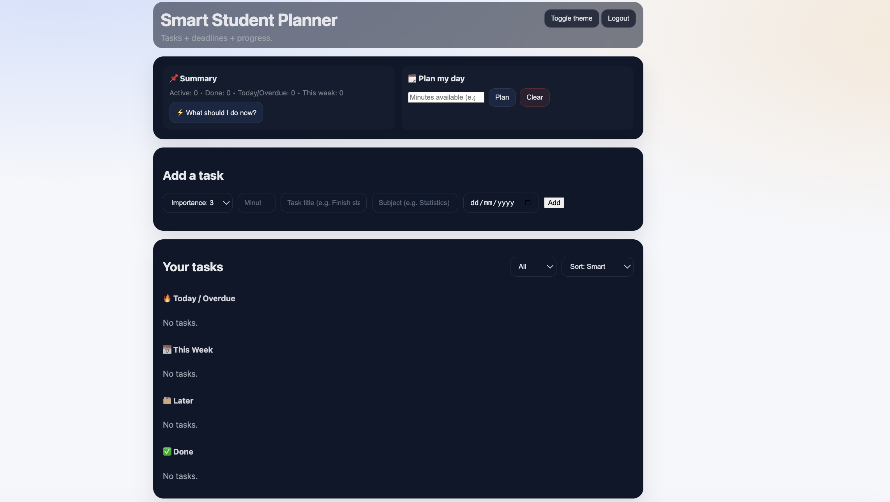

# Smart Student Planner

## Screenshots

### Login Page


### Dashboard


A productivity web application designed to help students organize tasks, manage deadlines, and intelligently plan study time.

Built with **FastAPI**, **SQLite**, and **Jinja2 templates**, the planner allows users to create tasks, prioritize work, and plan their day efficiently.

---

## Features

- User authentication system
- Create, complete, and delete tasks
- Smart priority scoring
- "What should I do now?" task recommendation
- Daily study planning based on available time
- Task grouping by deadlines (Today, This Week, Later)
- Light / Dark theme
- Persistent database storage using SQLite

---

## Tech Stack

### Backend
- FastAPI
- SQLModel
- SQLite
- Uvicorn

### Frontend
- HTML
- CSS
- JavaScript
- Jinja2 Templates

---

## Project Structure

```
Smart-Student-Planner
│
├── app
│   ├── routers
│   ├── core
│   ├── models.py
│   ├── schemas.py
│   ├── db.py
│   └── main.py
│
├── static
│   └── style.css
│
├── templates
│   ├── index.html
│   └── login.html
│
├── main.py
├── requirements.txt
├── .gitignore
└── README.md
```

---

## Running the Project Locally

### 1. Clone the repository

```bash
git clone https://github.com/WaseemAda/Smart-Student-Planner.git
cd Smart-Student-Planner
```

---

### 2. Create a virtual environment

```bash
python -m venv .venv
```

Activate it:

Mac / Linux

```bash
source .venv/bin/activate
```

Windows

```bash
.venv\Scripts\activate
```

---

### 3. Install dependencies

```bash
pip install -r requirements.txt
```

---

### 4. Run the application

```bash
python main.py
```

---

### 5. Open the app

Open your browser and go to:

```
http://127.0.0.1:8000
```

---

## Future Improvements

- Task analytics dashboard
- Recurring tasks
- Email / notification reminders
- Mobile responsive UI
- Cloud deployment
- Collaborative study planning

---

## Author

**Waseem Ada**

GitHub  
https://github.com/WaseemAda

---

## License

This project is open source and available under the MIT License.
